# Google's File Search + SpineDAO HeritageNEt

> Advanced OCR, Vector Search & Knowledge Graph Extraction for Historical Medical Documents

## 🚀 Features

### Core Capabilities
- **Advanced OCR Engine**: Gemini AI-powered text extraction with image preprocessing
- **Vector Search**: Google File Search for semantic document retrieval
- **Knowledge Graph**: CAMEL-AI + Neo4j for entity extraction and relationship mapping
- **RAG Support**: Retrieval Augmented Generation for contextual answers


## 🏗️ Architecture

```mermaid
graph TD
    User([User]) -->|Upload PDF| Flask 
    
    subgraph "Pipeline A: Semantic Search"
        Flask -->|1. Extract Metadata| Meta[Metadata Extractor]
        Meta -->|2. Index Document| VectorDB[(☁️ Google Vector Store)]
        User -->|Query| VectorDB
    end
    
    subgraph "Pipeline B: Knowledge Graph"
        Flask -->|1. Vision OCR| OCR[👁️ OCR Engine]
        OCR -->|2. Raw Text| Agent[🤖 Camel-AI Agent]
        Agent -->|3. Extract Entities| GEMINI[GEMINI_2-0-FLASH]
        GEMINI -->|4. Commit Data| Neo4j[(🧠 Neo4j Graph DB)]
    end
```



## 📋 Prerequisites

- Python 3.11+
- Google Cloud Platform account (for Gemini AI)
- Neo4j database 
- Groq account

## 🛠️ Installation

1. **Clone the repository**
   ```bash
   git clone <repository-url>
   cd file-search
   ```

2. **Install dependencies**
   ```bash
   uv sync
   ```

3. **Set up environment variables**
   Create a `.env` file in the project root:
   ```env
   # Google AI Services
   GEMINI_API_KEY=your_gemini_api_key_here
   
   # Neo4j Database
   NEO4J_URI=bolt://localhost:7687
   NEO4J_USERNAME=neo4j
   NEO4J_PASSWORD=your_neo4j_password
   
   # Optional
   PORT=5000
   ```

## 🚀 Quick Start

1. **Run the application**
   ```bash
   uv run main.py
   ```

2. **Open your browser**
   Navigate to `http://localhost:5000`

## 📚 Usage

### Web Interface

1. **Upload Documents**: Drag and drop PDF files onto the upload area
2. **Ask Questions**: Use the chat interface to query processed documents
3. **View Library**: Monitor processed documents in the sidebar
4. **Delete Documents**: Remove documents from the search index

### OCR Engine Options
- **Enhancement Levels**: `light`, `medium`, `aggressive`
- **DPI Settings**: 200 or 300 for scan quality
- **Medical Context**: Specialized prompts for medical terminology
- **Preprocessing**: Image enhancement and deskewing

### File Search Settings
- **Chunk Size**: 512 tokens per chunk
- **Overlap**: 50 tokens between chunks
- **Model**: Gemini-2.0-flash for search and responses

### Knowledge Graph Schema
- **Node Types**: 
  - `ClinicalObservation`
  - `TherapeuticOutcome`
  - `ContextualFactor`
  - `MechanisticConcept`
  - `TherapeuticApproach`
  - `SourceText`

- **Relationship Types**:
  - `co_occurs_with`
  - `preceded_by/followed_by`
  - `modified_by`
  - `responds_to`
  - `associated_with`
  - `results_in`
  - `described_in`
  - `contradicts/corroborates`

## 📁 Project Structure

```
├── main.py                 # Flask application entry point
├── file_search.py          # Vector search engine (Google AI)
├── ocr_engine.py           # Advanced OCR with Gemini Vision
├── kg_agents.py            # Knowledge graph extraction agent
├── templates/
│   └── index.html          # Web interface
├── uploads/                # Temporary file storage
├── debug_images/           # OCR preprocessing debug output
├── pyproject.toml          # Python dependencies
└── Procfile               # Heroku deployment config
```
